<p align="center"></p>

# Paisapeek

> *Peek at your paisa. Keep more of it.*

Paisapeek is a self-hosted money diary for people who want to know where every penny goes, without handing their bank SMS to a cloud app.

- **Tell it what you spent.** Type or dictate *"450 petrol, 200 chai with Rohan, lent 500 to Priya"* and review the cards before adding them.
- **Bank SMS turn into transactions automatically.** Duplicates are merged and you confirm each one in an inbox.
- **People and companies.** Track who owes you and whom you owe, with each person's history.
- **Accounts.** Savings, cards, credit lines and cash, with real balances and card statement and due-date reminders.
- **Recurring income and bills,** with push reminders and one-tap Paid / Received.
- **Installable on your phone (PWA),** with light and dark themes. It works on mobile first.
- **English, हिन्दी and Hinglish.** Adding a language is one `.po` file.
- **Full JSON backup and restore, plus CSV import and export.**

Built with Django, Django Ninja, HTMX and Tailwind, on SQLite. It's a single Docker volume.

## Screenshots

<sub>Phone-sized, with made-up demo data.</sub>

<table>
<tr><td align="center" valign="top">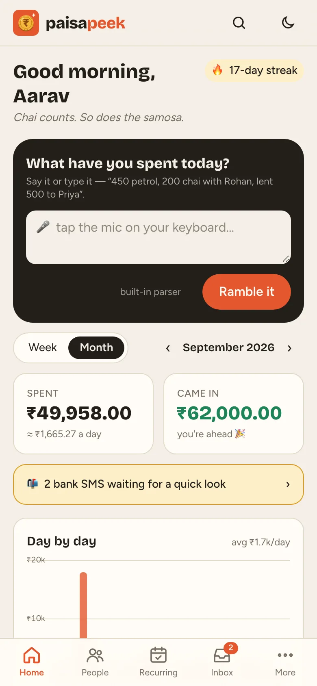<br><sub>Home: say or type what you spent</sub></td><td align="center" valign="top">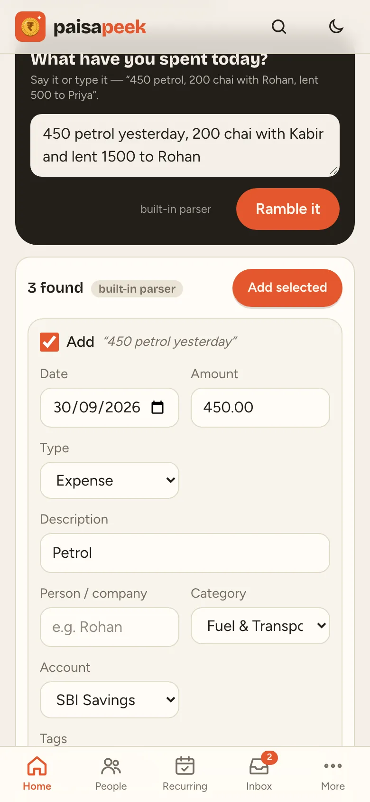<br><sub>Ramble → review cards before adding</sub></td><td align="center" valign="top">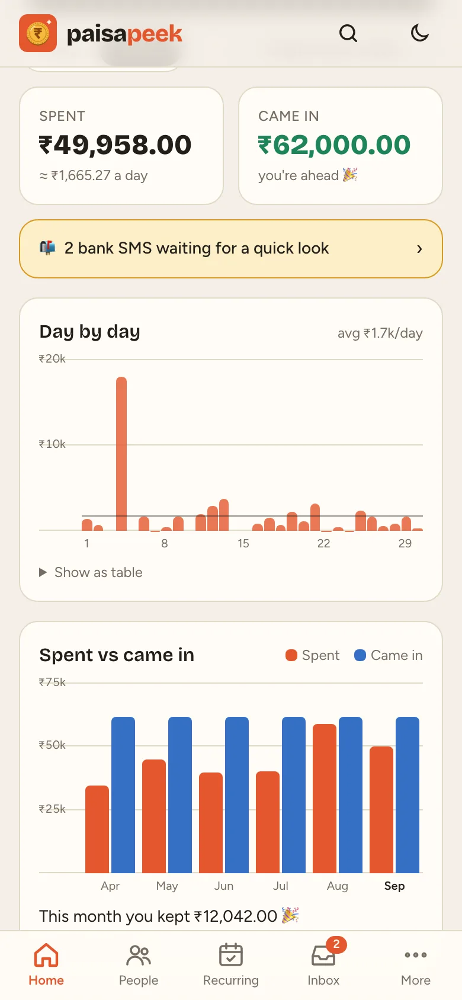<br><sub>Day by day + spent vs came in</sub></td></tr>
<tr><td align="center" valign="top">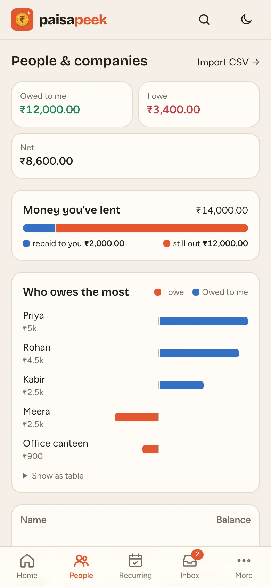<br><sub>People: who owes whom</sub></td><td align="center" valign="top">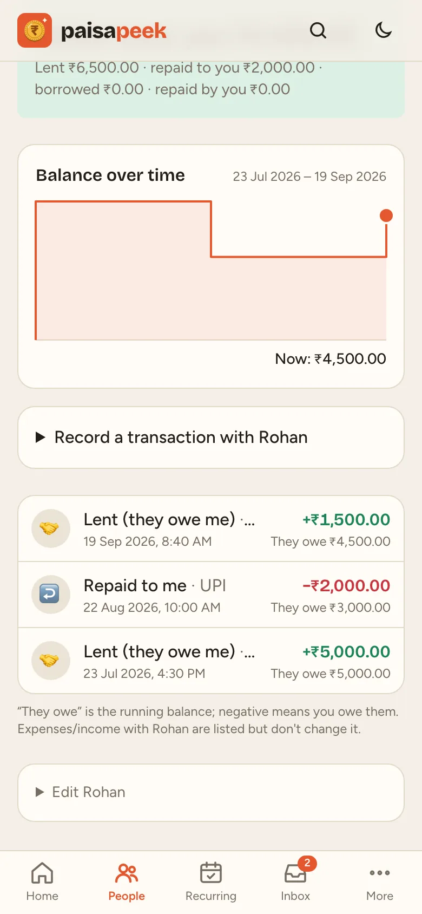<br><sub>A person's ledger over time</sub></td><td align="center" valign="top">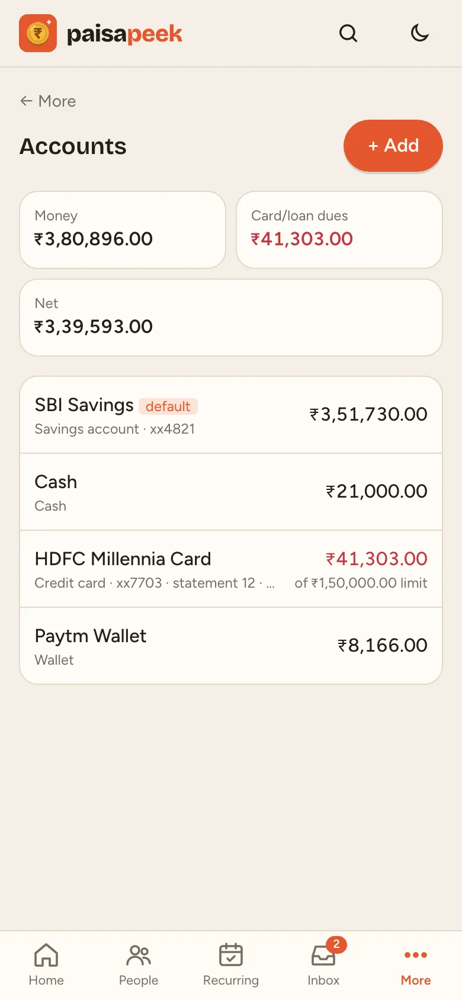<br><sub>Accounts, cards & balances</sub></td></tr>
<tr><td align="center" valign="top">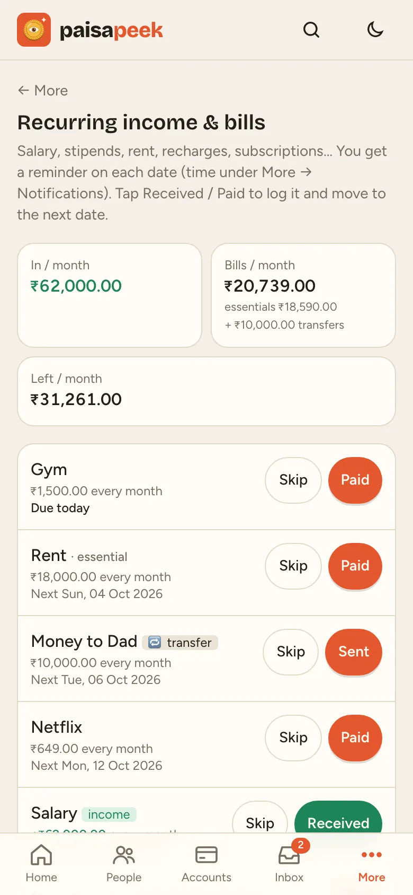<br><sub>Recurring income, bills & transfers</sub></td><td align="center" valign="top">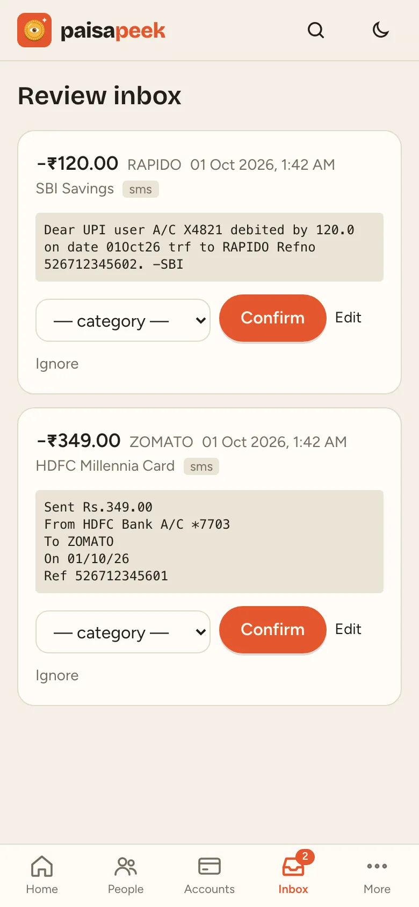<br><sub>Bank SMS waiting for review</sub></td><td align="center" valign="top">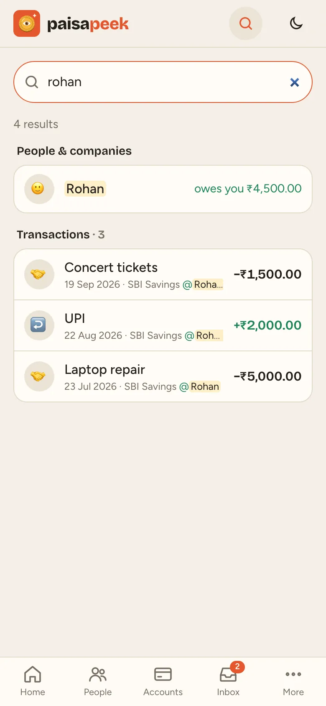<br><sub>Search everything</sub></td></tr>
<tr><td align="center" valign="top">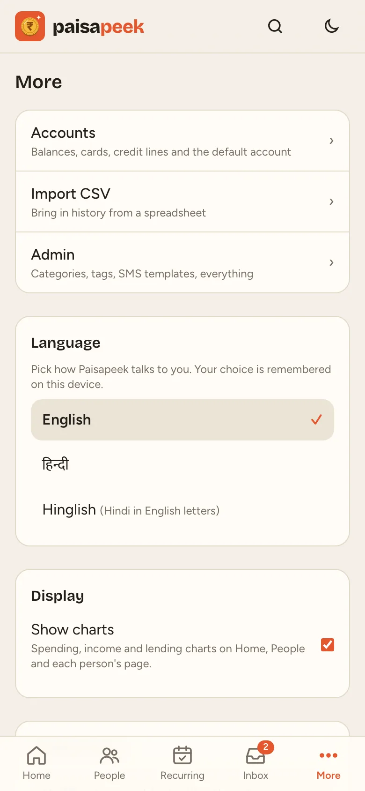<br><sub>More: language, charts, notifications, backup</sub></td><td align="center" valign="top">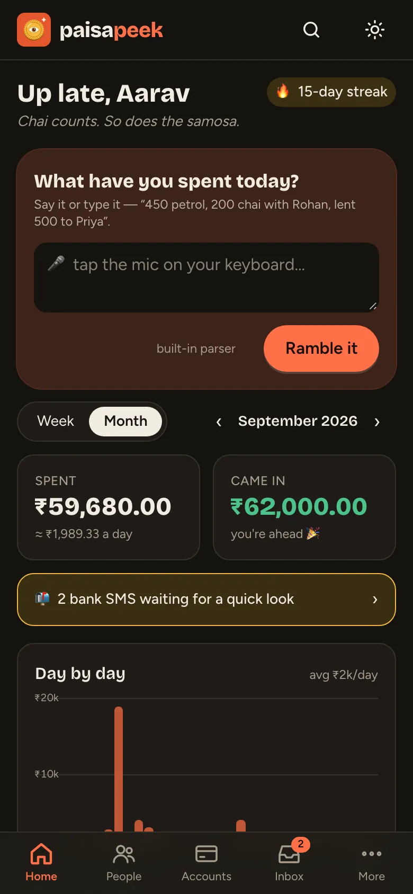<br><sub>Dark mode</sub></td><td align="center" valign="top">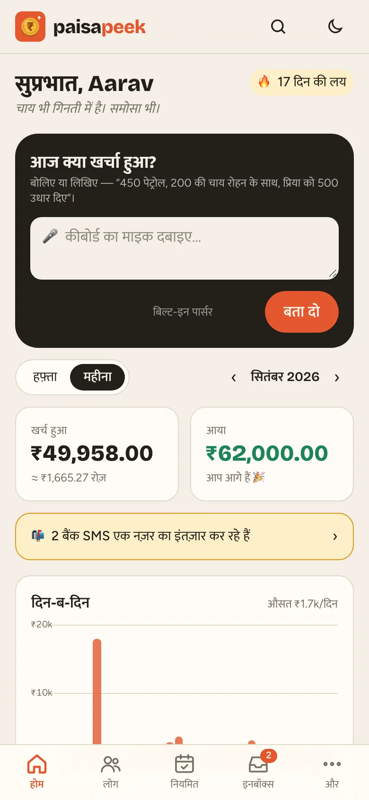<br><sub>हिन्दी</sub></td></tr>
<tr><td align="center" valign="top">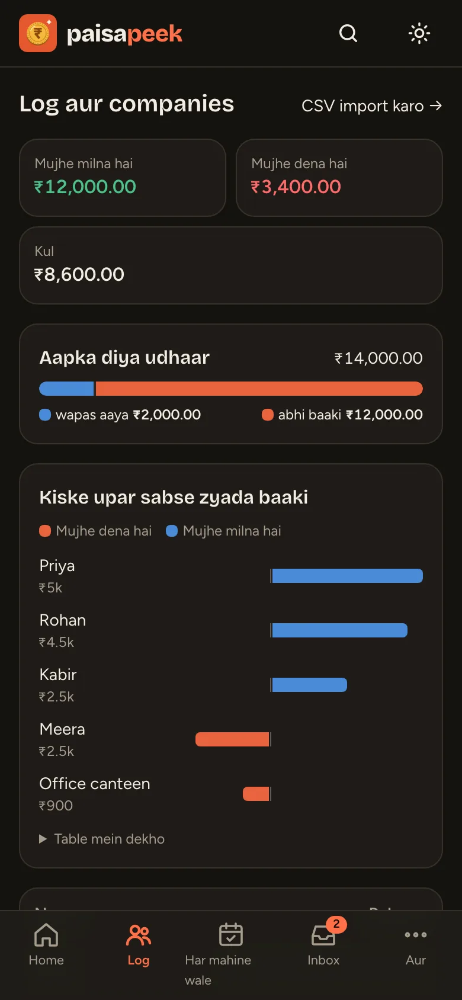<br><sub>Hinglish</sub></td></tr>
</table>

**→ [Deploy it on your server](DEPLOY.md)**: Docker, automatic HTTPS, phone install, backups.

## Develop

```bash
uv sync
uv run manage.py migrate
uv run manage.py createsuperuser
DEBUG=1 uv run manage.py runserver
uv run manage.py test ledger
uv run tailwindcss -i ledger/tailwind.css -o ledger/static/ledger/app.css --minify   # after changing classes
```

Data (the SQLite database and a generated secret key) is stored in `./data`, or wherever `DATA_DIR` points.

## Auto-capture from SMS (Android)

1. Install an SMS forwarder, for example **SMS to URL Forwarder** (F-Droid), MacroDroid or Tasker.
2. Filter by your banks' sender IDs (`HDFCBK`, `ICICIB`, `AXISBK`, `SBI`, `KOTAKB`, …).
3. POST to the URL shown on **Settings**, `https://<host>/api/ingest/sms?token=<token>`, with this JSON body:
   ```json
   {"sender": "%from%", "text": "%text%", "ts": "%receivedStamp%"}
   ```
   Placeholder syntax depends on the app; `ts` is optional (unix seconds or ms).

Interactive API docs are at `/api/docs`.

Parsed transactions land in **Inbox** as *pending*: confirm them with a category, or ignore them.
- OTP, offer and due-reminder messages are dropped.
- Duplicates are merged: the same UPI ref, or the same message sent again.
- Unknown card or account numbers create a placeholder account.

**Add support for another bank:** add a template in Admin, a regex with named groups `amount`, `merchant`, `last4`, `date` and `ref`. To ship it as a default for everyone, add it to `ledger/sms_templates.json` with a sample SMS in `ledger/tests.py`.

## On your phone (PWA)

Paisapeek is built for the phone:
- a bottom tab bar
- the Ramble box at the top of Home
- Home can show a week or a month, with spending grouped by day

**Install it:**
- **Android (Chrome):** menu ⋮ → *Install app*.
- **iPhone (Safari):** Share → *Add to Home Screen*.

Installing needs **HTTPS**. Put Caddy or Tailscale Serve in front of the server, and set `CSRF_TRUSTED_ORIGINS` (see `.env.example`).

## Accounts

Under **Accounts** you can add savings/current accounts, credit cards, credit lines, loans, cash and wallets.

- **Current balance:** enter what your bank shows now (for cards and loans, the amount you owe). The app works out the rest from your transactions, and you can re-enter it at any time to reconcile.
- **Default account:** one account is pre-selected for manual entries, Ramble and CSV rows.
- **Card bill payments:** record paying a card as a *Transfer* from savings to the card. Both balances move, and it doesn't count as spending.

## Notifications

Enable them under **More → Notifications** on each device. These are Web Push notifications, so the phone needs the installed PWA over HTTPS.

What you can get:
- a daily *"Log today's spending"* reminder, at a time you choose
- recurring income (salary, stipend) and bills/subscriptions, on the date or N days before (**More → Recurring**, where **Received**/**Paid** logs the transaction and moves the date on)
- credit card **statement day** and **payment due day** reminders, set on each card

The `scheduler` service in `docker-compose.yml` sends them (`python manage.py reminders --loop`). Set `VAPID_SUBJECT=mailto:you@yourdomain` in `.env`; Apple's push service rejects placeholder addresses.

## Ramble: say several transactions at once

Use the box at the top of **Home** and dictate with your keyboard's mic, or type, e.g. *"yesterday 450 petrol, 200 chai with Rohan for Goa trip and 1.2k swiggy on HDFC card. Got 5000 from Kabir last Friday."*

You get one editable card per transaction, with date, amount, type, description, category, account and tags filled in. Then choose **Add selected** or **Add just this** on each card.

A card that matches something already recorded (e.g. the same ₹450 that came in by SMS) is flagged and starts unticked.

**Built-in parser (default)** needs no setup:
- It understands amounts (`1.2k`, `Rs. 450`), today, yesterday, "3 days ago" and weekdays.
- A date said once carries on to the following items.
- Categories come from what you used last time for similar descriptions, then from keywords.

**Local LLM (optional)**, for messier speech:
- Set `LLM_MODEL` (and `LLM_BASE_URL`) to any OpenAI-compatible endpoint. Ollama is the default (see `.env.example`).
- Its output is still checked:
  - categories and accounts must exist
  - future dates are clamped to today
  - a tag must already exist or be said in the text
- If the LLM is unreachable, the built-in parser takes over.

## People & companies (lent / borrowed)

Every transaction can be linked to a person or company. Type a name in the **Person / company** field; a new name is created on save.

Four types track money between you and them:

| Type | Effect on what they owe you |
|---|---|
| **Lent** | + |
| **Repaid to me** | − |
| **Borrowed** | − |
| **Repaid by me** | + |

- **People** is the dashboard: total owed to you, total you owe, the net, and a balance per person. Settled people are hidden.
- Each person's page shows their full ledger with a running balance, and has a quick form to record a new entry.
- Ramble understands phrases like *"lent 500 to Rohan"*, *"Priya paid back 2000"* and *"borrowed 1500 from Chacha ji"*.

## Import CSV

**Import** (linked from People and Transactions) takes a CSV and shows every row on the same review cards as Ramble, so nothing is saved until you add it. Rows that already exist are flagged and unticked, so importing the same file twice is safe.

```csv
date,type,amount,description,party,category,account,tags,notes
2026-01-24,expense,500,Pizzahut,,Food & Outings,,JAN 24-25 Outing,
,lent,3000 + 1800,Lent,Arjun,,,,
2026-02-10,repaid_to_me,2000,Paid back via UPI,Arjun,,HDFC xx1234,,
```

Only `amount` is required.

| Column | Accepts |
|---|---|
| `date` | `YYYY-MM-DD` or `DD/MM/YYYY`; blank uses the date you pick on upload |
| `type` | `expense` (default), `income`, `transfer`, `lent`, `borrowed`, `repaid_to_me`, `repaid_by_me` |
| `amount` | `450`, `1,23,456.50`, or an Excel-style breakdown `720 + 775 + 380` (summed; the breakdown goes into notes) |
| `party` | a name; required for loan types, created if new |
| `category`, `account` | an existing name; the account can also be its last 4 digits. A blank category is guessed. |
| `tags` | separated by `;` |

[`ledger/static/ledger/import-sample.csv`](ledger/static/ledger/import-sample.csv) is built from the original spreadsheet and has 158 rows:
- the Assets sheet's breakdowns, one lent row per part
- the monthly sheets, dated the 1st of each month
- the Jan 24–25 trip
- the Sept 2025 card bills, as transfers

## Languages

Paisapeek ships in English, हिन्दी and **Hinglish** (`hi-latn`, Hindi in Latin letters). Switch with the 🌐 menu in the header or under **More → Language**; until you pick one, your browser's language is used.

It's standard Django i18n:
- UI text is marked with `` / `gettext` in the code.
- `makemessages` extracts it into one `.po` file per language, at `ledger/locale/<code>/LC_MESSAGES/django.po`.
- `compilemessages` builds the `.mo` that Django loads.

**Add a language**, e.g. Marathi:

1. Add `("mr", "मराठी")` to `LANGUAGES` in `config/settings.py`.
2. Extract the strings:
   ```bash
   cd ledger && uv run ../manage.py makemessages -l mr --ignore tests.py
   ```
3. Translate the `msgstr` lines in `ledger/locale/mr/LC_MESSAGES/django.po`, using any `.po` editor (Poedit, Weblate, or a text editor).
4. Compile:
   ```bash
   uv run manage.py compilemessages
   ```
   Then run the tests; `test_catalog_is_complete` fails if a string is untranslated or not compiled.

A few notes:
- Default category names are translated for display. Names you create stay as you typed them.
- Dates, AM/PM and common form errors are also in our catalogs (`ledger/i18n_data.py`). That fixes Django's Hindi spellings, and stops Devanagari leaking into Hinglish, because gettext falls back from `hi_Latn` to `hi`.
- CSV column names stay in English.

## Backup, restore & export

**More → Backup & restore**, or the welcome card on a fresh install, offers three things.

**Export full backup (.json)** holds everything:
- accounts and balances
- people and companies with their lent/borrowed history
- transactions with tags and times
- recurring bills
- categories and SMS templates
- notification settings and the SMS token

It restores on any Paisapeek install. The `data` inside is Django's standard serialization, so `manage.py loaddata` reads it, and the Restore button accepts plain `manage.py dumpdata ledger` output too. Login users and push-enabled devices aren't included. The file contains your SMS token, so keep it private.

**Restore** replaces all current data in one step: if anything in the file is bad, nothing changes. Before overwriting, it saves the current data to `DATA_DIR/backups/before-restore-*.json`.

**Export transactions (.csv)** is for Excel/Sheets and uses the same columns as Import CSV, so it imports back. The JSON backup is the one that keeps everything; CSV import skips `time`, `to_account` and `status`.

## Roadmap

- [x] Transactions, accounts, categories, login
- [x] SMS ingest, bank templates, dedupe, review inbox
- [x] Ramble mode (voice/typed multi-transaction entry) + tags
- [ ] Rules engine + merchant memory ("always categorize X as Y")
- [ ] Screenshot share target (PWA) + OCR + optional LLM fallback
- [x] People & companies ledger (lent/borrowed/repaid) + CSV import
- [x] Week/month home, mobile UI + installable PWA, accounts with balances, recurring, push reminders
- [ ] Budgets per category
- [ ] CSV import/export, Caddy HTTPS example
- [ ] Add interest rates of savings account and the interest credit duration and a cron job which run to do the calculation and increase the amount based on it. 
- 

